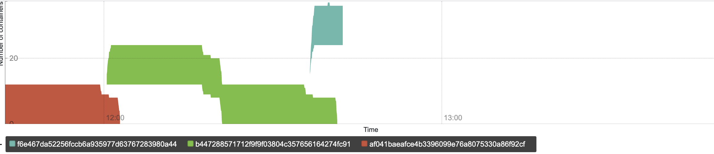

An example of oddly rendered time series in PromConsole.Graph,
in support of [prometheus issue 7711][].

How to use:

    docker build -t rendering-example .
    docker run -ti \
        -p 9090:9090 \
        -v "$(pwd)":/prometheus/consoles \
        rendering-example \
        /prometheus/prometheus

Then visit http://localhost:9090/consoles/index.html .

Here's what I see there:

The green and greenish-blue time series are unexpectedly elevated --
since they have no other time series under them, I expect them to be
resting on the x-axis, like the red time series does.

This example uses a hack to inject `data.json` as a `query_range` response.
That data was copied from a request with

    :path: /api/v1/query_range?query=sum%20by%20(code_version)%20(info)&step=4.171&start=1597318752.057&end=1597322352.057

to a server built from prometheus revision ce838ad6fcbd14b0cf9971a4d093ad672e1469fe.
The code that generated that request is the same as in `index.html` here
(except for `endTime`, as noted in comments there).

[prometheus issue 7711]: https://github.com/prometheus/prometheus/issues/7711
